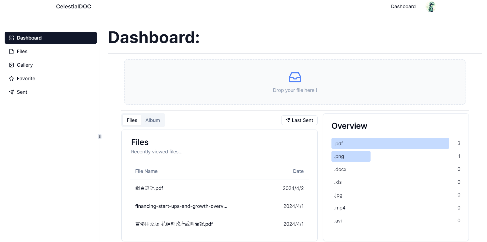

## CelestialDOC

CelestialDOC is an open source Google drive or Docsend alternative to store your files and easily share it with others with advanced Link Control. 

- Supports displaying PDF and most office documents
- Image Gallery
- Sharing files through email and removing access via link control
- Configure password and download control (download control only applies to PDF)


## Getting Started

Set Up .env:

```bash
//baseurl
NEXT_PUBLIC_BASE_URL=

NEXT_PUBLIC_CLERK_PUBLISHABLE_KEY=
CLERK_SECRET_KEY=

NEXT_PUBLIC_CLERK_SIGN_IN_URL=/sign-in 
NEXT_PUBLIC_CLERK_SIGN_UP_URL=/sign-up 
NEXT_PUBLIC_CLERK_AFTER_SIGN_IN_URL=/
NEXT_PUBLIC_CLERK_AFTER_SIGN_UP_URL=/

DATABASE_URL=
//the email you wish to send from 
Sender=
RESEND_API_KEY=

//S3 credentials
S3_UPLOAD_BUCKET=
S3_UPLOAD_REGION=
S3_UPLOAD_SECRET=
S3_UPLOAD_KEY=

```

## Optional

By default all files are stored on s3, but for image, if an R2_S3_ENDPOINT and
R2 bucket credentials are present, it will fetch that presigned url so you can
upload to R2 bucket

In order to user R2, you need to configure domain dns on cloudflare.
(Recommanded: set up a subdomain on cloudflare and point it to the R2 bucket)

```bash
R2_S3_ENDPOINT=
R2_ACCESS_KEY_ID=
R2_SECRET_ACCESS_KEY=
R2_BUCKET=
R2_URL=
```

AWS SES: recommanded outside of US
Sometimes Resend is a bit slow outside of US, so if you wish to use SES you can 
do so, give the SES access to the same S3 key/secret IAM role so you don't need 
to set up another pair of key. 

```bash
AWS_SES_REGION=
```


## Stack

- Nextjs
- Prisma with Postgres, a drizzle schema will be provided soon (WIP)
- Shdcn UI
- AWS S3 for documents
- Cloudflare R2 for album for optimized bandwidth 
- Clerk Auth
- Resend / AWS SES in the future (WIP)


## Deployment

The easiest way to deploy is 
- Vercel
- Cloudflare Pages (add Edge run time)
- Digital Ocean


##  Artwork

Special thanks to all the artist for amazing artwork !
Artworks used in the project falls under their 利用規約,
which grants personal use and commercial use, however
the copy right belongs to the original author and shall
not be registered for trademark. 

- [ガーリー素材] (https://girlysozai.com/)
- [Shigureni free illuse] (https://www.shigureni.com/)

## License

Open source under Apache 2.0 License, you are welcome to 

- Self host
- Make any modification 
- Commercialize it

In the case of commerical use, This License does not grant permission to use the trade names, trademarks, service marks, or product names of the Licensor. 
